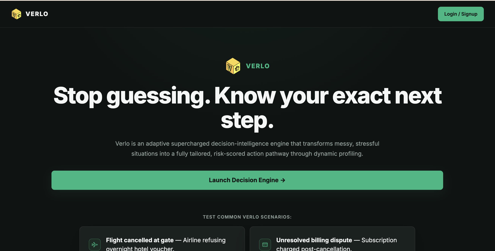

# Verlo

<div align="center">
  
</div>

**A decision-making tool that helps turn messy problems into clear next steps.**

Verlo is an AI-powered assistant for situations where it isn't always obvious what to do next.

You give it a problem, situation, or decision you're dealing with, and Verlo works through it with you. It asks follow-up questions when it needs more information, looks at the details you've provided, and then puts together a practical action plan.

The goal isn't just to give you another generic AI response. Verlo is designed to help you get from **“I don't know what to do”** to **“here's what I can do next.”**

## What Verlo Does

* **Asks follow-up questions**

  VerloAI can ask different questions based on **your response**. This means you don't have to fill out a huge form before getting started.

* **Breaks down complicated situations**

  It looks at factors such as urgency, possible risks, costs, and the information and evidence you've provided before putting together a response.

* **Creates practical action steps**

  Instead of stopping at an explanation, Verlo turns the result into steps you can actually follow to address **your problem**.

* **Helps with formal communication**

  Depending on the situation, Verlo can help prepare things such as complaint letters, dispute messages, or other formal correspondence.

* **Built-in safety checks**

  VerloAI runs server-side checks before sending information through the main AI system. Verlo uses both automatic filtering and AI-based moderation to catch unsafe requests and language.

* **Saved decision history**

  Signed-in users can save previous results and come back to them later through their history. Google login is also available alongside email authentication.

## BTS

**Problem → Follow-up questions → Analysis → Action plan**

That's the basic process Verlo uses. It starts with the information you provide. If it needs more context, it generates another question based on your previous answers.

You can also provide additional material such as images, videos, and documents, giving Verlo more information about the situation you're describing.

Once there is enough information, the backend sends the collected information to the AI and turns the response into structured data that the frontend can display.

This also means the questions aren't exactly the same every time. They can change depending on the situation and what you've already answered.

## Tech Stack

### Frontend

* React
* Vite
* JavaScript
* CSS

### Backend

* Node.js
* Express
* CORS
* JSON-based data storage

### AI

* Groq
* OpenAI OSS 120B

### Authentication

* JWT
* Google OAuth
* bcrypt

### Other

* Resend for email verification
* Server-side content moderation
* Responsive web UI

## Development

### 1. Clone the repository

```bash
git clone https://github.com/VihaanVinoth/verlo.git
cd verlo
```

### 2. Install the dependencies

If you're working with the backend:

```bash
npm install
```

### 3. Add your environment variables

Create a `.env` file for the server and add the values you need:

```env
PORT=5001
GROQ_API_KEY=your_groq_api_key
```

Depending on which features you're using, Verlo also uses environment variables for authentication, Google OAuth, email verification, and the frontend URL.

> [!WARNING]
> Never commit your `.env` file or API keys to GitHub. Keep your credentials private and make sure `.env` is included in your `.gitignore` file.

### 4. Start the server

```bash
npm run dev
```

The backend runs on port `5001` by default.

> [!TIP]
> If you change the backend port, make sure the frontend is also pointing to the new API address.

## Project Structure

The project is split into a React frontend and an Express backend.

```text
verlo/
├── client/
│   └── src/
│       ├── App.jsx
│       ├── main.jsx
│       └── ... (index.css, App.css, etc.)
│
├── server/
│   ├── server.js
│   └── data/
│       ├── users.json
│       └── history.json
│
├── public/
│   └── ...(images/favicons/thumbnail)
│
├── package-lock.json
└── ... (.gitignore, netlify.toml, etc.)
```

## A Note About AI

Verlo uses AI to help analyse the information it receives, but its output should still be checked by the person using it.

> [!IMPORTANT]
> For legal, financial, medical, or other important decisions, Verlo is intended to help organise information and possible next steps rather than replace a qualified professional.

## Why I Built It

I've seen that a lot of AI tools are good at answering questions, but what they lack isn't finding an answer, but rather figuring out **what to do next**. 

That's why I build Verlo as something that could take an unclear situation, ask for the information that actually matters, and actually turn it into something more useful than a wall of AI-generated text.
